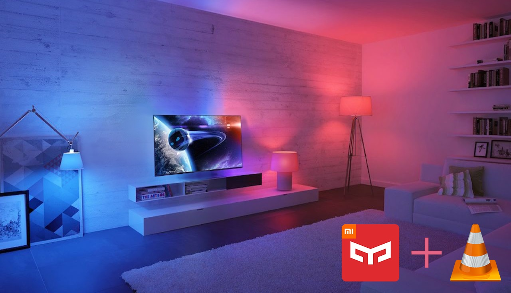
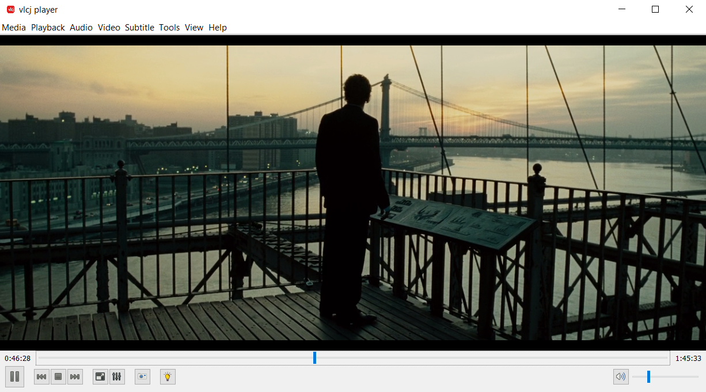

Adaptive light player
===========

Adaptive light player brings dynamic light changing functionality to a mediaplayer.
Adaptive light player uses Yeelight lamps.
Adaptive light player is based on [vlcj-player](https://github.com/caprica/vlcj-player) (v3). All additional information about this player you can find on the original page

If you are ready to install Adaptive light player, please read "Before you start". 

Screenshot
----------

Before you start
----------
You should install VLC player (64 bit) and Java from version 1.8 or higher.
You can compile program from the source files or just download executable [jar](https://github.com/rilmay/adaptive-light-player/releases/download/1.0/vlcj-player.jar).
Then you must create a file called "config.json" and place him in the same folder as a compiled jar.
In this file you should specify ip addresses of lamps.
You can also specify certain additional functions, which are described in "configuration guide".
I hope you enjoy my program!

Configuration guide
----------

All of the parameters are optional, except devices ip addresses.

Devices declaration:

`"devices": [
    {
      "ip": "xxx.xxx.xxx.xxx",
      "port": 55443,
      "screen_area": "whole screen",
      "features": [
        "brightness",
        "temperature"
      ]
    }
  ]`
  
`port` is needed in order to indicate the port in the receiving device. Default value is 55443.
`feature` is needed in order to specify features, that are applying on exact device.
Possible values: `brightness`, `temperature`, `color`. If you don't specify this value, the default feature would be `brightness`.
`screen_area` is needed in order to indicate which part of the image the lamp should analyze.
Possible values: `left`, `right`, `top`, `bottom`, `top left`, `top right`, `bottom left`, `bottom right`, `whole screen`. Default value is `whole screen`.

Feature rate declaration:

`"brightness_rate": 1.0,
"temperature_rate": 2.0`

Feature rate declaration is needed in order to adjust the intensity of brightness or color temperature. Both of them have limits from 0.5 to 4.0. Default value for both is 1.5.

Room check declaration:

`"room_check": "true",
"check_interval": 15,`

This function is needed in order to automatically set brightness and color temperature rates, depending on the current lighting in the room.
It takes a picture from your webcam to analyze the room. To disable this, you should not specify `room_check` or set this parameter to `false`.
To specify the room checking interval, you should put `"room_check": true` and `check_inerval` with value in minutes to config file. It should be more then 1 minute and less then 120.
Default value is 30 minutes.

Refresh interval declaration:

`"refresh_interval": 10000,`

This parameter is needed in order to specify the interval, at which program should perform image analyze. 
The smaller the interval, the more often the lighting will change. It should be more then 500 milliseconds and less then 60 seconds.
Default value is 1000 milliseconds.

Working example:

`{
   "brightness_rate": 1.0,
   "temperature_rate": 2.0,
   "room_check": "true",
   "check_interval": 10,
   "refresh_interval": 1000,
   "devices": [
     {
       "ip": "100.100.100.100",
       "port": 55443,
       "screen_area": "whole screen",
       "features": [
         "brightness",
         "temperature"
       ]
     },
     {
       "ip": "100.100.100.101",
       "port": 55443,
       "screen_area": "right"
       "features": [
         "brightness",
         "color"
       ]
     }
   ]
 }` 

Compiling from the source code
----------
You must first run `mvn initialize` in order to deploy the yapi from library in the local repo.
If you execute `mvn install` or `mvn package`, you will get a distribution package that you can unpack.

